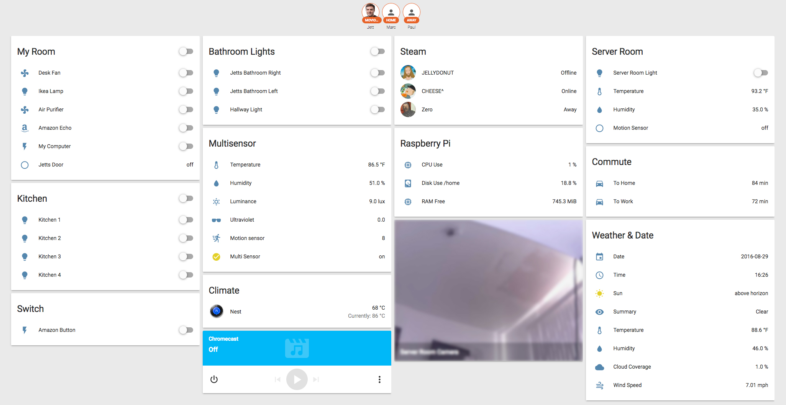

# Home Assistant
Home Assistant Configuration

## Devices
- [Nest Thermostat](http://amzn.to/2bwRVA4) 3rd Gen
- [Aeon Labs Aeotec Z-Wave Z-Stick](http://amzn.to/2c0VcXt) 5th Gen
- [Aeotec MultiSensor 6 ZW100-A](http://amzn.to/2bNo4Ud)
- [Aeon Labs DSC11-ZWUS Power Strip](http://amzn.to/2bwSb1D)
- [Ecolink Z-Wave Door/Window Sensor](http://amzn.to/2bwTiyC)
- [DHT11 Analog Temperature & Humidity Sensor ](http://amzn.to/2bEx3FC) GPIO
- [PIR Motion Sensor](http://amzn.to/2bEwAU3) GPIO
- [LIFX Color 1000 A19 Wi-Fi Smart LED Light Bulb](http://amzn.to/2c5PDqe) x3
- [LIFX White 800 A19 Wi-Fi Smart LED](http://amzn.to/2bNfwKq) x7
- [ASUS RT-N66U](http://amzn.to/2c5PTVV) Running [DD-WRT](https://www.dd-wrt.com/site/)
- [Raspberry Pi 3](http://amzn.to/2c5PiE0) Running Raspbian Jessie
- [Raspberry Pi 2](http://amzn.to/2bNprmb) TESTING Running [Raspberry Pi + Alexa Voice Service](https://github.com/amzn/alexa-avs-raspberry-pi)
- [Chromecast](https://www.google.com/chromecast) 1st Gen
- [Plex Media Server](https://www.plex.tv/)

# 
